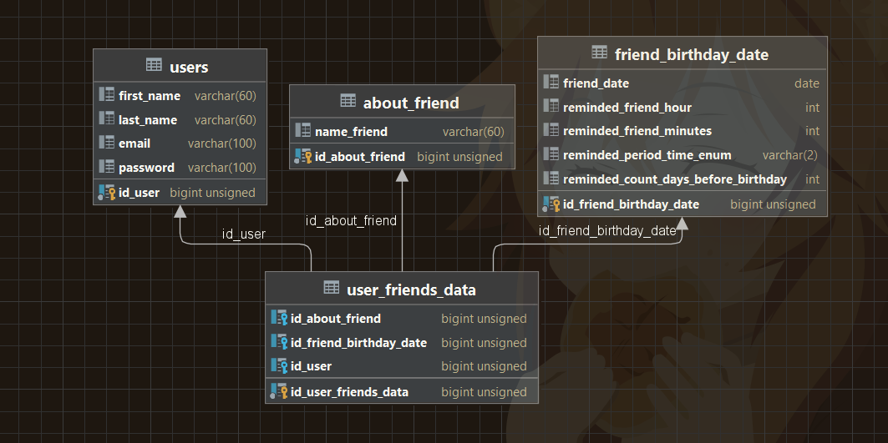
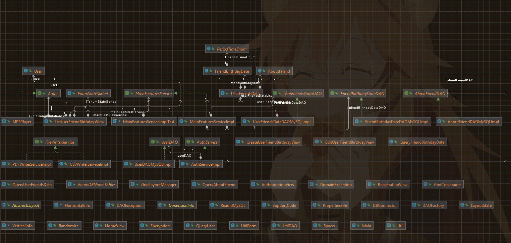
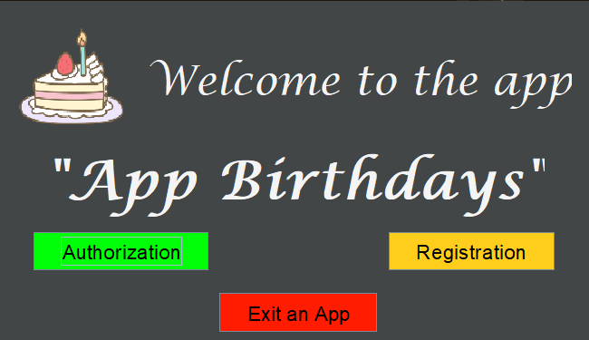
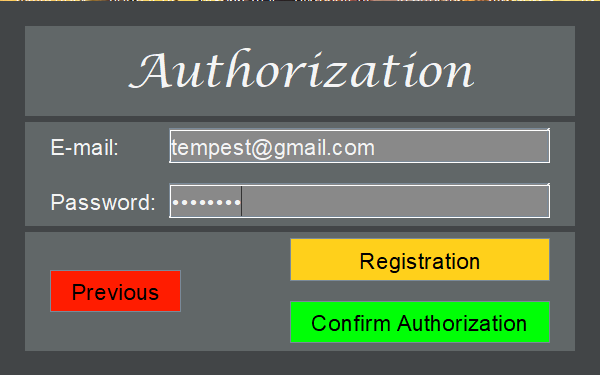
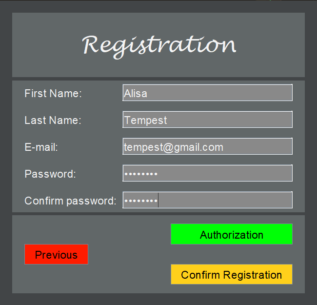
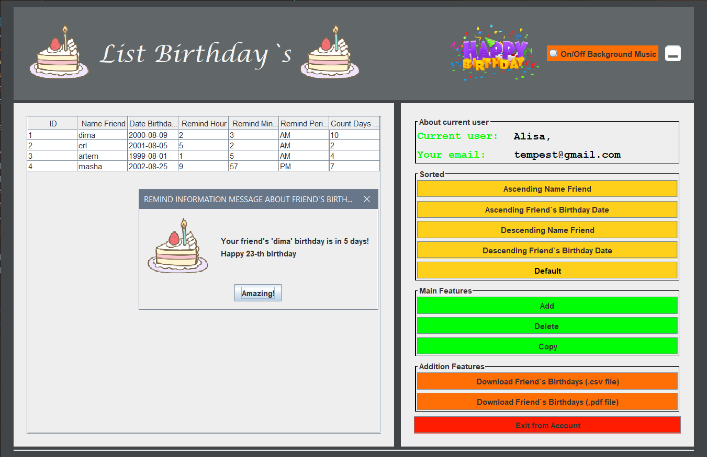
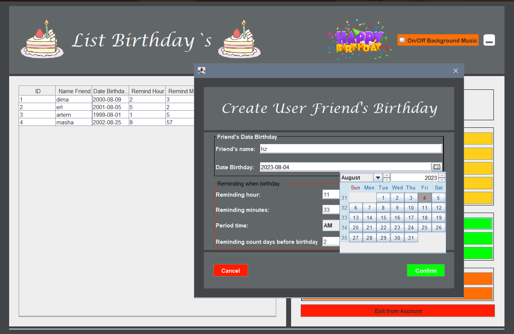
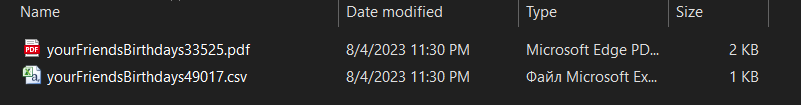
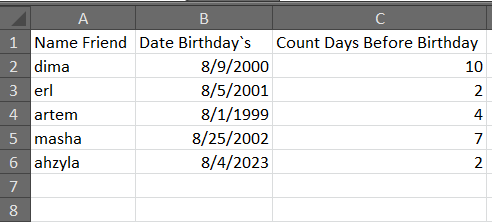
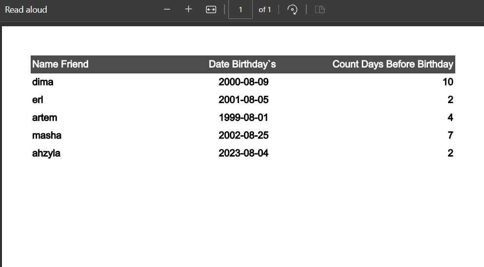

# App Birthdays

## Preview, I hope you enjoy it 😊
Welcome to App Birthdays, a project designed to manage and organize birthday information with a user-friendly interface.
This project is built using Java 11, JDBC API, MySQL Driver, and Java Swing for the graphical user interface.

### Project Structure
- This project uses jdk 11, JDBC API, MySQL Driver, GUI Java (Swing);
- The project is structured into several main packages:
   - `ui`: Contains the user interface components and logic.
   - `domain`: Includes the domain logic and models.
   - `dao`: Manages data access and database operations.
   - `main`: Consists of the Main class that serves as the program's entry point.
   - `models`: Contains shared models used across different layers;

### User Interface
- The user interface is built using the `Swing` library, providing an intuitive and interactive access.

### Database
- The project utilizes `MySQL` to store and manage information.

### Security
- User password information are encrypted using `SHA-256` for enhanced security.

### Extensibility
- The system is designed to be easily extensible, allowing for the addition of new features and improvements in the future.

### Testing
- The system is thoroughly tested using JUnit 5 to ensure its functionality and reliability.

### Logging
- Log4j2 is employed to provide logging (levels: `info`, `warn`, `error`).

### Dependencies
- The project uses several external dependencies to enhance its functionality, including:
  - `javazoom`: For audio-related features.
  - `opencsv`: For working with CSV files.
  - `itext7-core`: For PDF generation.
  - `jcalendar`: For handling date-related components.
  
## Features
- ☑️️Menu program (U can choose your act: Authorization, Registration, Exit);
  - ☑️Sing in;
  - ☑️Registration;
<br><br>
- ☑️ Main Program;
  - ☑️ Minimize program;
  - ☑️ On/Off background music;
  - ☑️ Reminding with sound for soon birthdays (u chose when give reminding (hour, minutes, after how many days));
  - ☑️ Sorted:
    - ☑️ Ascending for name user's friend;
    - ☑️ Ascending for friend's birthday date;
    - ☑️ Descending for name user's friend;
    - ☑️ Descending for friend's birthday date;
    - ☑️ Default (in order to add into db);
  - ☑️ Main features:
      - ☑️ Add data about friend birthday and him into table (click on special button `Add`);
      - ☑️ Edit info about human into table (click on chose human and `right click 2 times`);
      - ☑️ Delete info about human into table (click on chose human, click on special button `Delete` and confirm your choice as well);
      - ☑️ Copy info about human into table (click on chose human and click on special button `Copy` and click on Panel, entered combination `Ctrl+V`);
  - ☑️ Addition features (download data about birthday people into db):
    - ☑️ Download into .csv file;
    - ☑️ Download into .pdf file;
  - ☑️ Exit from account;

## Launch guide

1. To run this project you will need to install:
    - JDK 11 or higher;
    - MySQL RDBMS. 

2. If you have downloaded a project and want to run it with your own database then you have to create enum which will be
stored in a package `src/main/java/ua/birthdays/app/dao/env` and put your name tables please.

```java
public enum EnumDBNameTables {
    USER_TABLE("users"),
    USER_FRIENDS_DATA_TABLE("user_friends_data"),
    ABOUT_FRIEND_TABLE("about_friend"),
    FRIEND_BIRTHDAY_DATE_TABLE("friend_birthday_date");

    private final String enumDBEnvironment;

    EnumDBNameTables(String enumDBEnvironment) {
        this.enumDBEnvironment = enumDBEnvironment;
    }

    public String getEnumDBEnvironment() {
        return enumDBEnvironment;
    }
}
```

3. Also, please put your valid data in those properties. File stored in a `recourse` package.

```properties
# data for properties
app.birthdays.data.user.name=username
app.birthdays.data.password=password
app.birthdays.data.db.url=jdbc:RDBMS//host:port/nameDB

# name db
app.birthdays.data.db.name=namedb
```

4. Here are the steps for you to follow:
   - Add this project to your IDE as `Maven` project.
   - If necessary, configure `Java SDK 11` in `Project Structure settings`.
   - You can change setting to your logging into `log4j2.properties`.
   - First, you will need to register as a new user.

## Database

- You need to create database and add this name db to `db.properties`, and this all that u must to do in order to start to using this project.
<br><i><b>Visually it looks like this:</b></i>


## Diagram business logic

- The class diagram with dependencies:


## Program testing

### Main Menu



### Authorization



### Registration



### Main Window



### Action in Window
Main functions of the program will be showed below.👇

- Add data about friend birthday
  
- Edit info about human into table
  
- Download files with info about people birthday<br>
  
  - CSV file:<br>
  
  - PDF file:<br>
  
